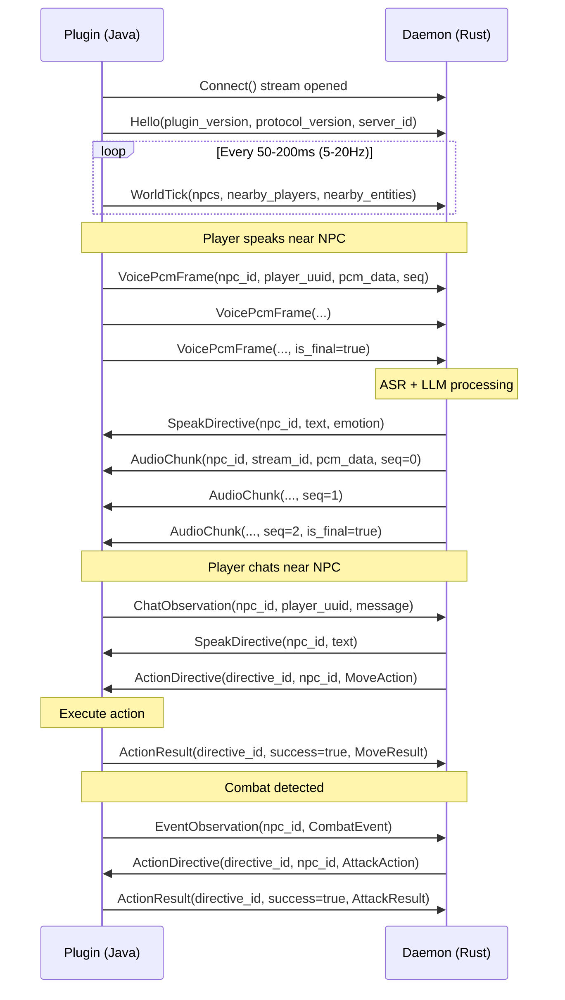

# Protocol Examples

Pseudo-code examples showing how to use the NPC Society protocol.

## Message Flow

A typical session between the Paper plugin (client) and daemon (server):



## Java Client (Plugin)

```java
// Pseudo-code for Paper plugin gRPC client

class NpcSocietyClient {
    private ManagedChannel channel;
    private StreamObserver<ClientMessage> outbound;
    
    void connect(String host, int port) {
        channel = ManagedChannelBuilder.forAddress(host, port)
            .usePlaintext()
            .build();
        
        var stub = NpcSocietyServiceGrpc.newStub(channel);
        
        // Open bidirectional stream
        outbound = stub.connect(new StreamObserver<ServerMessage>() {
            @Override
            public void onNext(ServerMessage msg) {
                switch (msg.getMessageCase()) {
                    case ACTION_DIRECTIVE -> handleAction(msg.getActionDirective());
                    case SPEAK_DIRECTIVE -> handleSpeak(msg.getSpeakDirective());
                    case AUDIO_CHUNK -> handleAudio(msg.getAudioChunk());
                }
            }
            
            @Override
            public void onError(Throwable t) {
                log.error("Stream error", t);
                scheduleReconnect();
            }
            
            @Override
            public void onCompleted() {
                log.info("Stream closed");
            }
        });
        
        // Send handshake
        outbound.onNext(ClientMessage.newBuilder()
            .setHello(Hello.newBuilder()
                .setPluginVersion("1.0.0")
                .setProtocolVersion("1")
                .setServerId(serverName)
                .setMinecraftVersion("1.20.4")
                .build())
            .build());
    }
    
    // Called from async tick scheduler (5-20Hz)
    void sendWorldTick(long serverTick) {
        var tick = WorldTick.newBuilder()
            .setServerTick(serverTick)
            .setTimestampMs(System.currentTimeMillis());
        
        // Add all managed NPCs
        for (var npc : npcManager.getAllNpcs()) {
            tick.addNpcs(NpcSnapshot.newBuilder()
                .setNpcId(npc.getId())
                .setEntityUuid(npc.getEntityUuid().toString())
                .setPosition(toProtoPosition(npc.getLocation()))
                .setHealthNorm(npc.getHealth() / npc.getMaxHealth())
                .setInCombat(npc.isInCombat())
                .build());
        }
        
        // Add nearby players (within radius of any NPC)
        for (var player : nearbyPlayers) {
            tick.addNearbyPlayers(PlayerSnapshot.newBuilder()
                .setPlayerUuid(player.getUniqueId().toString())
                .setPlayerName(player.getName())
                .setPosition(toProtoPosition(player.getLocation()))
                .setHealthNorm(player.getHealth() / player.getMaxHealth())
                .setHeldItem(player.getInventory().getItemInMainHand().getType().name())
                .setSneaking(player.isSneaking())
                .build());
        }
        
        outbound.onNext(ClientMessage.newBuilder()
            .setWorldTick(tick.build())
            .build());
    }
    
    // Called when Simple Voice Chat receives audio
    void sendVoiceFrame(String npcId, UUID playerUuid, byte[] pcmData, long seq) {
        outbound.onNext(ClientMessage.newBuilder()
            .setVoicePcmFrame(VoicePcmFrame.newBuilder()
                .setNpcId(npcId)
                .setPlayerUuid(playerUuid.toString())
                .setPcmData(ByteString.copyFrom(pcmData))
                .setSequence(seq)
                .setTimestampMs(System.currentTimeMillis())
                .build())
            .build());
    }
    
    void handleAction(ActionDirective directive) {
        var npc = npcManager.getNpc(directive.getNpcId());
        if (npc == null) {
            sendActionResult(directive.getDirectiveId(), false, "NPC not found");
            return;
        }
        
        // Execute on main thread
        Bukkit.getScheduler().runTask(plugin, () -> {
            try {
                switch (directive.getActionCase()) {
                    case MOVE -> executeMove(npc, directive.getMove());
                    case BREAK_BLOCK -> executeBreakBlock(npc, directive.getBreakBlock());
                    case ATTACK -> executeAttack(npc, directive.getAttack());
                    // ... other actions
                }
            } catch (Exception e) {
                sendActionResult(directive.getDirectiveId(), false, e.getMessage());
            }
        });
    }
    
    void handleSpeak(SpeakDirective speak) {
        var npc = npcManager.getNpc(speak.getNpcId());
        // Display subtitle to nearby players
        for (var player : npc.getNearbyPlayers()) {
            player.sendActionBar(Component.text(speak.getText()));
        }
    }
    
    void handleAudio(AudioChunk chunk) {
        // Queue audio for Simple Voice Chat playback
        voiceChatBridge.queueAudio(chunk.getNpcId(), chunk.getPcmData().toByteArray());
    }
}
```

## Rust Server (Daemon)

```rust
// Pseudo-code for daemon gRPC server

use tonic::{Request, Response, Status, Streaming};
use tokio::sync::mpsc;
use tokio_stream::wrappers::ReceiverStream;

struct NpcSocietyDaemon {
    autonomy_engine: Arc<AutonomyEngine>,
    asr_pipeline: Arc<AsrPipeline>,
    tts_pipeline: Arc<TtsPipeline>,
}

#[tonic::async_trait]
impl NpcSocietyService for NpcSocietyDaemon {
    type ConnectStream = ReceiverStream<Result<ServerMessage, Status>>;

    async fn connect(
        &self,
        request: Request<Streaming<ClientMessage>>,
    ) -> Result<Response<Self::ConnectStream>, Status> {
        let mut stream = request.into_inner();
        let (tx, rx) = mpsc::channel(128);
        
        let autonomy = self.autonomy_engine.clone();
        let asr = self.asr_pipeline.clone();
        let tts = self.tts_pipeline.clone();
        
        tokio::spawn(async move {
            while let Some(Ok(msg)) = stream.next().await {
                match msg.message {
                    Some(ClientMsg::Hello(hello)) => {
                        log::info!("Client connected: {} (MC {})", 
                            hello.server_id, hello.minecraft_version);
                        // Validate protocol version
                        if hello.protocol_version != "1" {
                            log::warn!("Protocol version mismatch");
                        }
                    }
                    
                    Some(ClientMsg::WorldTick(tick)) => {
                        // Feed to autonomy engine
                        for npc in &tick.npcs {
                            autonomy.update_npc_state(npc).await;
                        }
                        for player in &tick.nearby_players {
                            autonomy.update_player_state(player).await;
                        }
                        
                        // Check for pending actions from autonomy decisions
                        while let Some(directive) = autonomy.pop_directive().await {
                            let _ = tx.send(Ok(ServerMessage {
                                message: Some(ServerMsg::ActionDirective(directive)),
                            })).await;
                        }
                    }
                    
                    Some(ClientMsg::ChatObservation(chat)) => {
                        // Process chat through LLM
                        let response = autonomy
                            .process_chat(&chat.npc_id, &chat.player_name, &chat.message)
                            .await;
                        
                        if let Some(reply) = response {
                            // Send text response
                            let _ = tx.send(Ok(ServerMessage {
                                message: Some(ServerMsg::SpeakDirective(SpeakDirective {
                                    npc_id: chat.npc_id.clone(),
                                    text: reply.clone(),
                                    emotion: "neutral".into(),
                                    duration_ms: 3000,
                                })),
                            })).await;
                            
                            // Generate TTS and stream audio
                            let stream_id = uuid::Uuid::new_v4().to_string();
                            let audio_chunks = tts.synthesize(&reply).await;
                            
                            for (seq, chunk) in audio_chunks.iter().enumerate() {
                                let _ = tx.send(Ok(ServerMessage {
                                    message: Some(ServerMsg::AudioChunk(AudioChunk {
                                        npc_id: chat.npc_id.clone(),
                                        stream_id: stream_id.clone(),
                                        pcm_data: chunk.clone(),
                                        sequence: seq as u64,
                                        is_final: seq == audio_chunks.len() - 1,
                                    })),
                                })).await;
                            }
                        }
                    }
                    
                    Some(ClientMsg::VoicePcmFrame(frame)) => {
                        // Buffer audio and run ASR when silence detected
                        if let Some(transcript) = asr.process_frame(
                            &frame.npc_id,
                            &frame.player_uuid,
                            &frame.pcm_data,
                        ).await {
                            // Treat transcript like chat
                            let response = autonomy
                                .process_chat(&frame.npc_id, "Player", &transcript)
                                .await;
                            
                            // Send response (same as chat handling)
                            // ...
                        }
                    }
                    
                    Some(ClientMsg::EventObservation(event)) => {
                        autonomy.process_event(&event.npc_id, &event).await;
                    }
                    
                    Some(ClientMsg::ActionResult(result)) => {
                        autonomy.handle_action_result(&result).await;
                        
                        if !result.success {
                            log::warn!("Action {} failed: {}", 
                                result.directive_id, result.error_message);
                        }
                    }
                    
                    None => {}
                }
            }
        });
        
        Ok(Response::new(ReceiverStream::new(rx)))
    }
}

#[tokio::main]
async fn main() -> Result<(), Box<dyn std::error::Error>> {
    let addr = "0.0.0.0:50051".parse()?;
    
    let daemon = NpcSocietyDaemon {
        autonomy_engine: Arc::new(AutonomyEngine::new()),
        asr_pipeline: Arc::new(AsrPipeline::new()),
        tts_pipeline: Arc::new(TtsPipeline::new()),
    };
    
    Server::builder()
        .add_service(NpcSocietyServiceServer::new(daemon))
        .serve(addr)
        .await?;
    
    Ok(())
}
```

## Key Implementation Notes

### Threading Model

**Java (Plugin)**
- gRPC runs on Netty threads (never block)
- Action execution must happen on Minecraft main thread via `Bukkit.getScheduler()`
- WorldTick capture runs on async scheduler at 5-20Hz

**Rust (Daemon)**
- Fully async with tokio runtime
- Each connection spawns a task
- Heavy compute (LLM, ASR, TTS) should use `spawn_blocking` or dedicated pools

### Audio Format

- Sample rate: 48000 Hz
- Channels: 1 (mono)
- Bit depth: 16-bit signed PCM
- Frame size: 960 samples (20ms at 48kHz)

### Error Handling

- Always send `ActionResult` even on failure
- Use `error_message` field for debugging
- Daemon should not crash on malformed messages
- Plugin should reconnect on stream errors with exponential backoff

